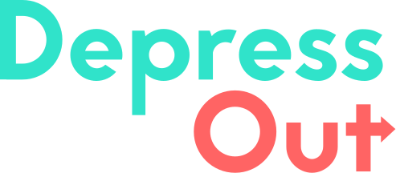

# Depressout

Projekt społeczny stworzony na potrzeby olimpiady [Zwolnieni Z Teorii](https://zwolnienizteorii.pl/).
Mamy na celu pomoc ludziom dotkniętym depresją.

## Autorzy

Programiści:

- [@bartoginski](https://www.github.com/bartoginski)
- [@W1KTOR3435](https://github.com/W1KTOR3435)
- [@xDeJwiD](https://github.com/xDeJwiD)
- [@Oski-Boski](https://github.com/Oski-Boski)

Designer:

- [@deniskgl](https://github.com/deniskgl)

Copywriter

- [@justiiogi](https://github.com/justiiogi)

## Włączenie projektu

Sklonuj projekt

```bash
  git clone git@github.com:bartoginski/DepressOut.git
```

Przejdź do folderu projektu

```bash
  cd DepressOut
```

Zainstaluj zależności

```bash
  npm install
```

Włącz serwer

```bash
  npm run dev
```

Po chwili wpisz w przeglądarce [http://localhost:3000](http://localhost:3000)

## Stack Technologiczny

- Nuxtjs
- Tailiwndcss
- AOS
- PWA support
